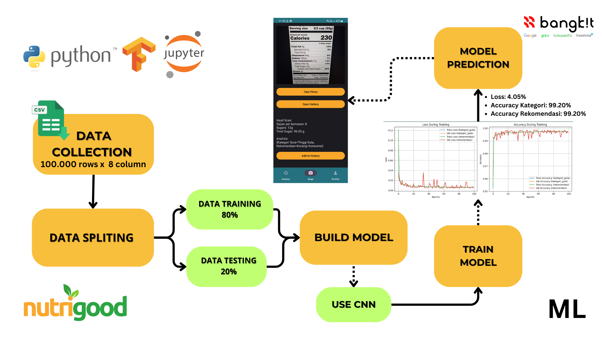

# Nutrigoood: OCR-Based Nutritional Prediction Analysis System

[](https://github.com/GaluhPncWirs/capstone-project-for-ML/fork)  
[](https://github.com/GaluhPncWirs/capstone-project-for-ML/stargazers)  



This prject is OCR-based system that extracts and analyzes nutritional information from food labels, providing quick and accurate insights to support healthier dietary choices.

## Fitur  
- **Menghasilkan dataset sintetis** dengan variasi pada atribut seperti gula, total gula, usia, berat badan, dan lainnya.  
- **Klasifikasi gula** berdasarkan total gula (rendah, sedang, tinggi).  
- **Rekomendasi konsumsi** berdasarkan pedoman kesehatan.  
- **Output dalam format CSV** siap untuk analisis lebih lanjut.  

## Struktur Dataset  
Kolom pada dataset meliputi:  
1. **Serving Per Package** - Jumlah penyajian dalam satu paket.  
2. **Gula (g)** - Kandungan gula per penyajian (gram).  
3. **Total Gula (g)** - Total gula dalam satu paket (gram).  
4. **Umur** - Usia individu (tahun).  
5. **Berat Badan (kg)** - Berat badan individu (kilogram).  
6. **Riwayat Diabetes** - Status diabetes individu (Ada/Tidak).  
7. **Kategori Gula** - Klasifikasi gula (Rendah, Menengah, Tinggi).  
8. **Rekomendasi** - Saran konsumsi berdasarkan total gula.  

## Instalasi  
1. Clone repositori ini:  
   ```bash
   git clone https://github.com/username/advanced-nutrition-dataset.git
   cd advanced-nutrition-dataset
   ```
2. Install dependensi yang dibutuhkan:  
   ```bash
   pip install pandas numpy
   ```

## Penggunaan  
1. Jalankan skrip `generate_advanced_nutrition_dataset.py`:  
   ```bash
   python generate_advanced_nutrition_dataset.py
   ```  
2. Dataset akan dihasilkan dalam file `advanced_nutrition_data.csv`.  
3. Gunakan dataset untuk analisis atau keperluan machine learning.  

## Contoh Output  
```csv
Serving Per Package,Gula (g),Total Gula (g),Umur,Berat Badan (kg),Riwayat Diabetes,Kategori Gula,Rekomendasi
5,10.5,52.5,45,70.8,Tidak Diabetes,Tinggi Gula,Lebih Baik Tidak Dikonsumsi
3,4.2,12.6,25,60.1,Ada Diabetes,Rendah Gula,Aman Dikonsumsi
```
## Team  
Developed by **ML TEAM | C242-PS345**
- (ML) M262B4KY1585 – Galuh Panca wirasa – Universitas Muhammadiyah Prof Dr Hamka
- (ML) M284B4KX3378 – Nina Meylinda Syukriyah – Universitas Negeri Surabaya 
- (ML) M315B4KX3947 – Rizqi Hairunnisa – Universitas Sriwijaya

## Lisensi  
Proyek ini dirilis di bawah lisensi MIT.  
